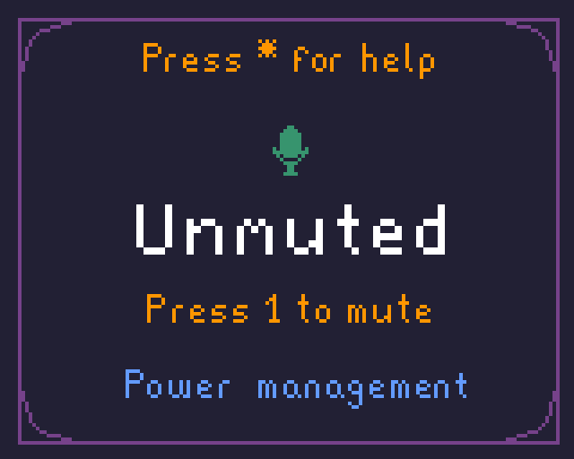

# 🕹 Macropad

Basic macropad made using Arduino (Leonardo). It's work in progress, so many things are hardcoded.

## 👤 Credits
Project was made by Aleksander Jóźwik ([@jozwikaleksander](https://github.com/jozwikaleksander)).